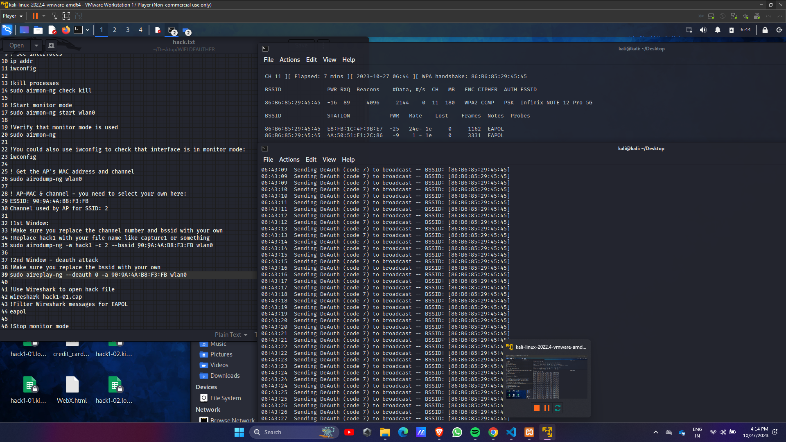

# Auto-Deauth

<h1>Auto Deauther : Wifi Deauthentication </h1>

 
<h2>Autocrack: Helps you to crack wifi passwords &amp; Deauthenticate WIFI</h2>
<h1>WiFi Deauthentication Script</h1>
A simple Bash script for performing WiFi deauthentication attacks. This script is designed to send deauthentication packets to a target access point or client, effectively disrupting the target's ability to connect to the WiFi network.

<h1>Features</h1>
Deauthenticate clients or access points from a WiFi network.
User-friendly interface for specifying target MAC addresses.
Customizable deauthentication packet parameters for more precise attacks.
Getting Started
To get started with the script, simply clone the repository and ensure that you have the necessary dependencies installed. Run the script with the appropriate permissions to begin deauthentication attacks on the specified targets.

<h1>bash</h1>
Copy code
git clone https://github.com/ShreyashWanjari/Auto-Deauth.git
cd wifi-deauth-script
chmod +x deauth.sh
./deauth.sh
Usage
The script provides a simple command-line interface for specifying the target MAC address and choosing the type of deauthentication attack. Follow the on-screen prompts to select the target and initiate the deauthentication process.

<h1>bash</h1>
Copy code
Usage: ./deauth.sh [options]
Options:
  -a, --access-point  Perform deauthentication attack on a specific access point
  -c, --client        Perform deauthentication attack on a specific client
  -h, --help          Show help message and exit
<h1>Disclaimer</h1>
This script is intended for educational and research purposes only. Misuse of this script for any malicious activities is strictly prohibited. The developers are not responsible for any unlawful or unethical use of this script.

<h1>Contributions</h1>
Contributions and feedback are welcome! Feel free to submit issues and pull requests to help improve the functionality and security of the script.

<h1>License</h1>
This project is licensed under the MIT License - see the LICENSE file for details.

